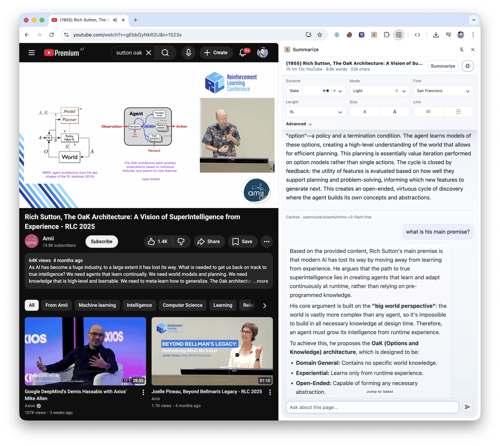
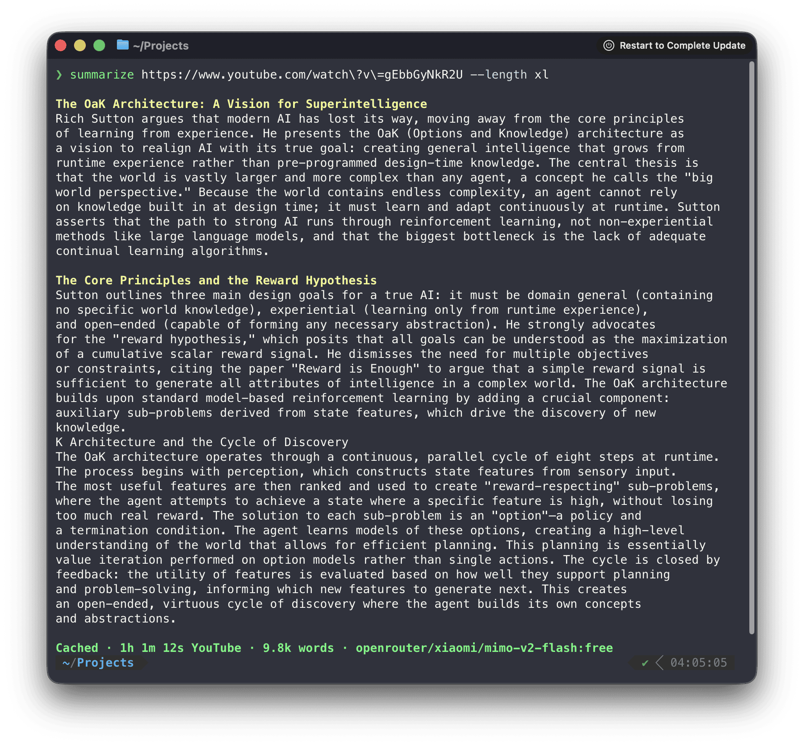
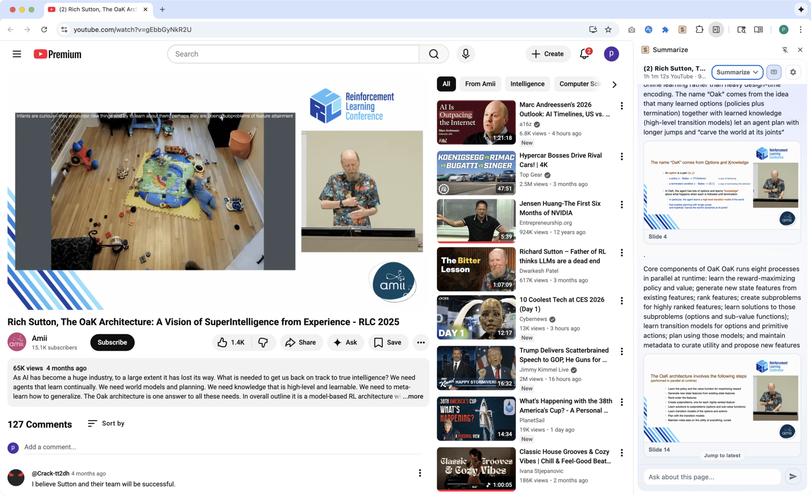

# Summarize 📝 — Link in, signal out.

[](https://github.com/steipete/summarize/actions/workflows/ci.yml)
[](https://www.npmjs.com/package/@steipete/summarize)
[](https://nodejs.org/)
[](LICENSE)

Summarize extracts clean text and produces summaries from web pages, files, YouTube videos, podcasts, and other audio or video. Use it from the Node.js CLI or from the Chrome Side Panel and Firefox Sidebar.



```console
$ summarize "https://example.com" --extract --plain
This domain is for use in documentation examples without needing permission. Avoid use in operations.
[Learn more](https://iana.org/domains/example)
```

## Install

Run it once without installing:

```bash
npx -y @steipete/summarize --version
```

Or install the CLI with npm or Homebrew:

```bash
npm install --global @steipete/summarize
```

```bash
brew install summarize
```

The npm package requires Node.js 24 or newer. Homebrew/core and the [macOS archives on GitHub Releases](https://github.com/steipete/summarize/releases/latest) provide standalone builds. See the [installation guide](docs/install.md) for optional media tools and platform notes.

## Quick start

Extract readable content without an API key:

```bash
summarize "https://example.com" --extract --plain
```

For a model-generated summary, configure a [supported provider](docs/llm.md) or use an authenticated coding CLI:

```bash
summarize "https://example.com" --cli codex
```

The default `auto` model chooses among configured providers. The [five-minute quickstart](docs/quickstart.md) covers API keys, local models, files, YouTube, podcasts, and JSON output.

## What it handles

| Input                        | Processing path                                                        |
| ---------------------------- | ---------------------------------------------------------------------- |
| Web pages                    | Readability extraction, with optional Markdown and Firecrawl fallbacks |
| PDFs, images, and text files | File-aware extraction and model attachments where supported            |
| YouTube and podcasts         | Published transcripts first, then configured transcription fallbacks   |
| Audio and video              | Local or cloud transcription, with optional speaker labels             |
| Video slides                 | Scene-based frames, optional OCR, and timestamped output               |

Use `--extract` when you only need clean content, `--json` for a stable automation envelope, and `--slides` for video frames. The [command reference](docs/commands/index.md) documents every flag.



## Browser extension

Install [Summarize Side Panel from the Chrome Web Store](https://chromewebstore.google.com/detail/summarize/cejgnmmhbbpdmjnfppjdfkocebngehfg) to summarize the active tab, chat with its content, and work with video transcripts and slides.

Direct mode runs without a companion service. Browser media uses Chrome capabilities for local transcription and slide extraction; the optional daemon adds CLI model backends, native media tools, OCR, shared caches, and Firefox media support.

To pair the installed CLI, copy the token shown by the extension and run:

```bash
summarize daemon install --token <TOKEN>
```

See the [extension setup](apps/chrome-extension/README.md) and [architecture and troubleshooting guide](docs/chrome-extension.md).

## Media and slides

Summarize prefers existing captions and podcast transcripts before it transcribes media. Native `ffmpeg`, `yt-dlp`, and `tesseract` extend codec, YouTube slide, and OCR support; a bundled WebAssembly FFmpeg path covers common media without a native install.



The focused guides describe [YouTube extraction](docs/youtube.md), [media routing](docs/media.md), [slides](docs/slides.md), and [local ONNX transcription](docs/nvidia-onnx-transcription.md).

## Models and configuration

Model IDs use `provider/model` names. Summarize works with configured API providers, OpenAI-compatible endpoints, Ollama, OpenRouter free models, and authenticated coding CLIs such as Codex, Claude, Gemini, OpenClaw, and GitHub Copilot.

Configuration lives at `~/.summarize/config.json`; command-line flags take precedence. Inspect the effective setup without exposing keys:

```bash
summarize status
```

Read the [model guide](docs/llm.md), [automatic selection rules](docs/model-auto.md), [CLI provider guide](docs/cli.md), and [configuration reference](docs/config.md) for the full setup.

## Library

For programmatic extraction without the CLI dependency surface, install [`@steipete/summarize-core`](https://www.npmjs.com/package/@steipete/summarize-core):

```bash
npm install @steipete/summarize-core
```

The package exports focused content and prompt entry points. See the [core package README](packages/core/README.md) for usage.

## Documentation

Start with the [documentation index](docs/README.md), then follow the guide for your task:

- [Installation](docs/install.md) and [quickstart](docs/quickstart.md)
- [Commands](docs/commands/index.md) and [configuration](docs/config.md)
- [Website extraction](docs/website.md) and [Firecrawl fallback](docs/firecrawl.md)
- [YouTube](docs/youtube.md), [media](docs/media.md), and [slides](docs/slides.md)
- [Agent skill](.agents/skills/summarize/SKILL.md) for automated workflows

## Development

Requires Node.js 24 and pnpm 11.22.0.

```bash
pnpm install --frozen-lockfile
pnpm build
pnpm check
```

See [CONTRIBUTING.md](CONTRIBUTING.md) for repository layout and extension workflows.

## License

MIT. See [LICENSE](LICENSE).
